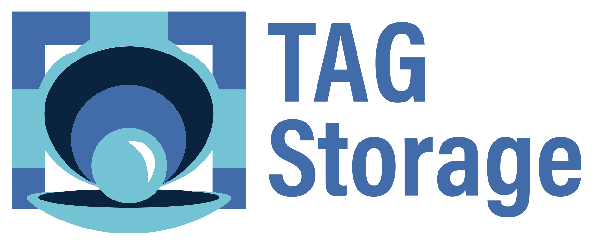

# CNCF storage Technical Advisory Group

<!-- cspell:disable -->
<!-- markdownlint-disable-next-line MD033 MD013 -->

<!-- cSpell:enable -->

## Quick links

- [Meeting Information](#meeting-times)
- [Slack Information](#communications)
- [New Members](#new-members)
- [Members](#members)

## Objective
<<objective>>

## Background
<<background>>

## Vision
<<vision!!!!!>>

## Governance

[STAG charter](governance/charter.md) outlines the scope  of our group
activities, as part of our [governance process](governance) which details how we
work.

## Communications

Anyone is welcome to join our open discussions of STAG projects and share news
related to the group's mission and charter. Much of the work of the group
happens outside of storage TAG meetings and we encourage project teams to share
progress updates or post questions in these channels:

Group communication:

- [Email list](https://lists.cncf.io/g/cncf-tag-storage)
- [CNCF Slack](https://slack.cncf.io/) #tag-storage channel

Leadership:

- To reach the leadership team (chairs & tech leads), email
  cncf-tag-storage-leads@lists.cncf.io
- To reach the chairs, email cncf-tag-storage-chairs@lists.cncf.io

### Slack governance

Refer to the [slack governance document](slack.md) for details on slack channels
and posting to the channels.

## Meeting times

Group meeting times are listed below:
The Storage Technical Advisory Group meets on the 2nd and 4th Wednesday of every month at 8AM PT (USA Pacific).

See the  [CNCF Calendar](https://www.cncf.io/calendar/) for calendar invites.

[Meeting minutes and
agenda](https://bit.ly/cncf-storage-sig-minutes)

### Zoom Meeting Details

<!-- cSpell:ignore cncftagstorage -->
[Meeting Link](https://zoom.us/j/2920471159?pwd=em1JbE44MktjZE4vbnJtUUFQcGZwdz09) (Password: 77777)

One tap mobile:
| Location | Number |
| --- | --- |
|US (San Jose)|+16699006833,158580155#|
|US (Tacoma)|+12532158782,158580155#|
|US (Washington DC)|+13017158592,158580155#|
|US (Chicago)|+13126266799,158580155#|
|US (Houston)|+13462487799,158580155#|
|US (New York)|+16465588656,158580155#|

Dial by your location:
| Location | Number |
| --- | --- |
| US - New York | +1 646 558 8656|
| US - San Jose | +1 669 900 6833|
| US - Toll-free | 877 369 0926|
| US - Toll-free | 855 880 1246|
| Australia - Toll-free | 158 580 155|

Or [find your local number](https://zoom.us/u/alwlmxlNn).

Meeting ID: 158 580 155

## Gatherings

Please let us know if you are going and if you are interested in attending (or
helping to organize!) a gathering. Create a [github
issue](https://github.com/cncf/tag-storage/issues/new) for an event and add to
list below:

- KubeCon + CloudNativeCon, Europe May 16-20 2022

## New members

If you are new to the group, we encourage you to check out our [New Members Page](NEW-MEMBERS.md)

## Related groups

There are several groups that are affiliated to or do work and cover topics relevant
 to the work of storage TAG. These can be seen [here](governance/related-groups/)

## Members
<!-- cSpell:disable -->

### Chairs

- Alex Chircop [Chair term: ??? - ???]
- Quinton Hoole [Chair term: ??? - ???]
- Xing Yang [Chair term: ??? - ???]

### Tech Leads

 - Raffaele Spazzoli
 - Luis Pabon
 - Sheng Yang
 - Nick Connolly
