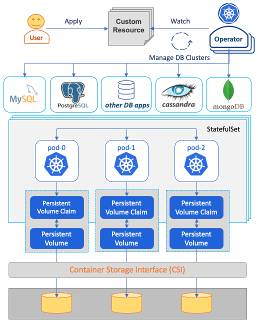

# Data on Kubernetes Whitepaper - Database Patterns

**Version 1 (Dec 2023)**

* **Authors**: Alvaro Hernandez, Gabriele Bartolini, Patrick McFadin, Raffaele Spazzoli, Tom Prohofsky, Xing Yang
* **Reviewers**: Donna Reineck-Wehan, Josh Berkus, Mark Lavi, Max Jonas Werner, Melissa Logan, Michelle Au, Robert Hodges, Victor Lu

## Table of Contents

<!-- toc -->
- [Introduction](#introduction)
  - [Goals](#goals)
  - [Non-Goals](#non-goals)
- [Storage System Attributes](#storage-system-attributes)
  - [Attributes](#attributes)
    - [Availability](#availability)
    - [Consistency](#consistency)
    - [Durability](#durability)
    - [Scalability](#scalability)
    - [Performance](#performance)
    - [Observability](#observability)
    - [Elasticity](#elasticity)
  - [Storage Stacks](#storage-stacks)
    - [Stacks/Layers](#stackslayers)
    - [Disaster Recovery](#disaster-recovery)
      - [Active/Passive Strategies](#activepassive-strategies)
      - [Active/Active Strategies](#activeactive-strategies)
- [Running Databases Inside vs Outside of Kubernetes](#running-databases-inside-vs-outside-of-kubernetes)
- [Common Patterns and Features](#common-patterns-and-features)
  - [Kubernetes Operator](#kubernetes-operator)
  - [Container Storage Interface (CSI)](#container-storage-interface-csi)
  - [Kubernetes Workload APIs](#kubernetes-workload-apis)
  - [Topology Aware Scheduling](#topology-aware-scheduling)
  - [Pod Disruption Budget](#pod-disruption-budget)
  - [Resource Management](#resource-management)
  - [Separation of Control Plane and Data Plane](#separation-of-control-plane-and-data-plane)
  - [Default Secure](#default-secure)
- [Observability](#observability-1)
- [Security](#security)
  - [Transport Layer Security and Certificate Management](#transport-layer-security-and-certificate-management)
  - [Encryption at Rest](#encryption-at-rest)
  - [Authentication/Authorization Integration with Kubernetes](#authenticationauthorization-integration-with-kubernetes)
- [Day 2 Operations](#day-2-operations)
  - [Upgrade](#upgrade)
  - [Backup/Restore](#backuprestore)
  - [Increase/Decrease Storage Capacity](#increasedecrease-storage-capacity)
  - [Data Migration](#data-migration)
<!-- /toc -->

## Introduction

This whitepaper is a collaboration between the CNCF TAG Storage and Data on Kubernetes Community.

According to the [2022 DoK Survey](https://dok.community/data-on-kubernetes-2022-report/), Data on Kubernetes has a transformative impact on organizations, showing a direct link between running DoK and making big gains in terms of revenue and productivity. The survey shows data workloads on Kubernetes include databases, analytics, AI/ML, and streaming/messaging.

The purpose of this document is to describe the patterns of running data on Kubernetes with a focus on database applications. We will describe what are the attributes of a storage system and how they affect the database applications, how different storage stacks affect these attributes, what are the differences of running data inside and outside of Kubernetes, what are the characteristics of Kubernetes that are beneficial for running data on Kubernetes, and what are the best practices and lessons we have learned from running data on Kubernetes.

To describe the attributes of a storage system and how they affect the database applications, we will reference our previous whitepapers, including the CNCF [Storage Landscape Whitepaper](https://docs.google.com/document/d/1Ag9PxdIe3iaMHcI5joHjyqo-x7fbIQErT02XkZz7Zvw/edit#heading=h.uvwp1nxx8pio), the [Cloud Native Disaster Recovery Whitepaper](https://docs.google.com/document/d/10HcaLqPz8o8oXpbSNbPI0thVMoF3usTG3CAhq4Umz4w/edit#heading=h.yxipa1r9o82b), and the [Performance Whitepaper](https://docs.google.com/document/d/1r9gPg9wLwm2GAmEoSn_HOqMwWZjwCuT6TysclvPWVQU/edit#heading=h.9pnpbccsswm1).

Here are the goals and non-goals of this document.

### Goals

* Describe the attributes of a storage system and how they affect the database applications.
* Describe the benefits of running data on Kubernetes.
* Describe the patterns of running data on Kubernetes, focusing on database applications.
  * This may include common patterns that affect both database applications and non-database applications.
  * This may also include patterns that are unique to database applications.

### Non-Goals

* Non-database applications will not be a focus in this document, but it could be added in future editions.

## Storage System Attributes

In the [Storage Landscape Whitepaper](https://docs.google.com/document/d/1Ag9PxdIe3iaMHcI5joHjyqo-x7fbIQErT02XkZz7Zvw/edit#heading=h.uvwp1nxx8pio), we discussed storage system attributes including availability, consistency, scalability, durability, and performance. In addition to those, observability and elasticity are also important attributes in a cloud native environment. All of these have an impact on running data on Kubernetes. In this section, we will give a brief introduction of these attributes, and then discuss how storage stacks could have an impact on them.

### Attributes

#### Availability

Availability can be defined by the ability to access the data during failure conditions. It defines how access to the data continues during a failure condition and also how access to the data is failed over to another access node in the event that the node that is accessing the data is unavailable.

For a Cloud Native Database, availability can be based on the number of replicas. Users of a primary/standby database usually expect that failover is entirely automated in Kubernetes.

#### Consistency

Consistency attributes of a storage system refer to the ability to access newly created data or updates to the same after it has been committed. Systems that have delays between read operations returning up-to-date data, and/or delays before all data is protected after getting committed are defined as being “eventually consistent”. If there are no delays, the system is defined as being “strongly consistent”. Some database systems implement synchronous replication to control this, even at the level of a single transaction.

Note that “Consistency” definition means different things in the context of the [CAP Theorem](https://en.wikipedia.org/wiki/CAP_theorem) (concerning Consistency, Availability and Partition-tolerance) and [ACID](https://en.wikipedia.org/wiki/ACID#Characteristics) (Atomicity, Consistency, Isolation, Durability) database transactions properties. See more details in the  [Storage Landscape White Paper](https://docs.google.com/document/d/1ayeALoU5jrO5x96N7bqXmLx0O-rAIh2HllZBgtYwz3Q/edit#heading=h.qread87bum7d).

#### Durability

Durability of a storage system refers to the attributes of a storage system that impact the ability for a data set to endure as opposed to just being accessible. Durability can be impacted by the data protection layers, the level of redundancy of the system, the endurance characteristics of the storage media, and the ability to detect corruption of data and recover from it.

Note that “Durability” has a different definition in the context of the [ACID](https://en.wikipedia.org/wiki/ACID#Characteristics) (Atomicity, Consistency, Isolation, Durability) database transactions properties. It guarantees that once a transaction has been committed, it will remain committed even in the case of a system failure. Most database systems rely on a technique known as write-ahead logging (WAL) to achieve data durability, by ensuring that changes are first stored in the database transaction log. See more details in the  [Storage Landscape White Paper](https://docs.google.com/document/d/1ayeALoU5jrO5x96N7bqXmLx0O-rAIh2HllZBgtYwz3Q/edit#heading=h.qread87bum7d). For a Cloud Native Database, durability can be based on the number of replicas, as well as the presence of a reliable backup system that continuously stores transactional information in a safe location. A data loss event requires all replicas and backups to be lost.

#### Scalability

Scalability refers to the ability to grow the resources of a storage system so that it can serve increasing usage. Criteria used to measure scalability include the ability to scale the number of clients, throughput (e.g. MB/sec), capacity, etc. Scaling can be done vertically or horizontally.

Vertical scaling refers to scaling a single server by increasing resources such as CPU. It can also be adding separate volumes, to achieve parallel I/O on the same node, and fully exploit features like tablespaces and table partitioning.

Horizontal scaling refers to scaling by increasing the number of servers. Cloud Native Databases typically use sharding to facilitate horizontal scaling. For example, [Vitess](https://vitess.io/), a graduated CNCF project, has a built-in sharding feature to scale MySQL horizontally.

#### Performance

Scalability is being able to handle large amounts of traffic. Performance is about application response time/speed.

The performance of storage systems can be measured using low level throughput metrics like I/Os per second and megabytes transferred per second but these may vary widely based on workload.  Factors like transfer size, sequential access, Read/write ratio and many others all impact storage performance.   While servicing a given workload the storage system’s response time can be characterized by average and maximum latency over a period of time.  Benchmark tools like [FIO](https://git.kernel.dk/cgit/fio) can measure the storage performance of a persistent volume. The [Prometheus node-exporter](https://github.com/prometheus/node_exporter) is one example of a tool able to monitor average latency.

Data locality refers to how close the underlying storage is to the pod or service consuming the persistent volume claim.  When compute and storage are inadvertently separated, unwanted or hidden latency may slow down application response times.  Using pod affinity attributes enables the orchestrator to optimize placement of application processes.  

#### Observability

Effective monitoring of IT infrastructure is essential for ensuring optimal performance and minimizing downtime. In modern computing environments, especially in distributed applications, monitoring every component is critical to maintaining high service levels. Failure to monitor any service or system, even for a short period, can result in significant consequences for the entire system, making monitoring a critical aspect of building and maintaining cloud-native applications. The interdependencies between different services in a distributed environment can create complex failure scenarios, making it even more important to have comprehensive observability capabilities.

In data systems, monitoring the flow and status of infrastructure is vital due to the large volumes of data that are commonplace. Efficient monitoring systems that provide early warning for potential issues can help operators prevent costly downtime and ensure the continuous flow of information. Building robust infrastructure observability frameworks that incorporate monitoring, logging, and tracing capabilities is critical to gain visibility into every aspect of the infrastructure. This enables the identification of potential bottlenecks, failures, and errors that can impact the performance of the entire system. In conclusion, observability is an essential aspect of modern IT infrastructure, and implementing effective monitoring systems is a crucial step towards ensuring optimal performance, reliability, and availability of cloud-native applications and data systems.

#### Elasticity

In modern computing environments, elasticity is a critical aspect of infrastructure management. While scalability focuses on adding resources to meet demand, elasticity goes a step further by enabling the release of resources when they are no longer required. This feature allows organizations to optimize their resource utilization, ensuring that they only pay for the services and resources they need. The ability to scale up and down quickly is a defining characteristic of elastic infrastructure, which is also referred to as on-demand infrastructure. In environments with limited resources, such as private data centers, elasticity is essential for efficient resource allocation and utilization.

In data management, elasticity means having the ability to optimize storage space usage by reclaiming storage when no longer needed. This can involve moving older data to less expensive storage tiers or archiving it to long-term storage to free up space for more critical data. Cloud infrastructure, which charges for every resource used, can benefit greatly from this feature, as it helps to prevent unnecessary costs from running services that are no longer required. An elastic infrastructure that can rapidly respond to changes in demand and adjust resource allocation accordingly is a vital component of modern IT systems, enabling organizations to maintain optimal performance, scalability, and cost-effectiveness.

### Storage Stacks

There are several storage stacks (layers) that can impact the storage system attributes, including orchestrator, host, and operating system, storage topology, data protection layers, additional data services provided by the storage system, and the physical non-volatile layer.

#### Stacks/Layers

* A number of virtualization and access layers are often overlaid or interposed on a Data Access Interface as part of the integration of the storage solution into an orchestrated environment, and can influence Availability, Scalability and Performance of the overall end to end solution.
* Storage topology describes the arrangement of storage and compute resources and the data link between them. This includes centralized, distributed, sharded, and hyper-converged topologies.
* Storage systems usually have a data protection layer which adds redundancy. This refers to RAID, Erasure coding, and Replicas.
* Storage systems usually provide Data Services in addition to the core storage functions, including replication, snapshots, clones, and so on. The ability to take incremental snapshots is critical for supporting efficient backups and for reducing recovery times from backups.
* Storage system ultimately persists data on the physical storage layer which is usually non-volatile. It has an impact on overall performance and long-term durability.

#### Disaster Recovery

Disaster Recovery is relatively easy for stateless workloads but becomes more involved for stateful applications as we have to solve the problem of how to synchronize the state between the various instances of the workload.

Typically one has to define a strategy to recover from a disaster for each workload that runs a given failure domain (normally a datacenter or a cloud region). This strategy should also encompass managing possible dependencies between workloads. We are going to focus only on strategies that target a single workload.

The main metrics to measure disaster recovery are as follows:
* Recovery Time Objective (RTO): the amount of time it takes to restore the service.
* Recovery Point Objective (RPO): how back in time we have to go from the time of the disaster, in order to have consistent data available in the recovery site.

At a high-level we have two approaches that we can use for a disaster recovery strategy:
* Active/Passive
* Active/Active

##### Active/Passive Strategies

With active/passive strategies, one failure domain receives all of the requests and the passive site is on standby for when a disaster happens. The standby site can sometimes be configured to serve read requests, but in general, will be either warm (the workload is there but is not doing anything) or cold (the workload will be deployed at the time of the disaster).

These are the main state synchronization approaches between the active and the passive:
* Backup and restore. Periodic backups are executed. When a disaster hits, the data is restored at the passive location. This approach works only with a cold passive site. The RPO for this approach is equal to the backup frequency. Some database management systems support relaying write-ahead log (WAL) files in the other location, further reducing RPO; they also control how frequently WAL files can be archived (e.g. maximum every 5 minutes).
* Asynchronous volume replication: storage is configured to replicate writes to the stateful workload volume on the passive location. Replication is asynchronous. This implies faster response for write requests, but it also means that if writes come faster than can be synchronized there might be an unbounded amount of changes queued to synchronized. RPO for this depends on the relative speed of request writes vs synchronization writes. This approach works with warm recovery sites (at least the storage must be on).
* Synchronous volume replication: storage is configured to replicate writes to the stateful workload volume on the passive location. Replication is synchronous. This means slower response for write requests as the latency to write to the remote location must be accounted for. At the same time though, RPO is exactly zero. This approach works with warm recovery sites (at least the storage must be on).
* Database-level replication. Some database management systems have a native way to replicate data that is normally based on the write-ahead log and that can be used to synchronize data between instances in the active and passive site, over the network. This is also known as primary/secondary setups. Based on the latency between the active and passive site, replication can be asynchronous or synchronous, guaranteeing in the latter case zero RPO. Some database management systems enable asynchronous replication via WAL file shipping, without requiring a streaming connection between the different sites. This approach works with warm recovery sites.

##### Active/Active Strategies

For active/active strategies we need workloads that are designed to have multiple active instances that can all receive writes. These are also known as stateful distributed workloads. Stateful distributed workloads can spread across several failure domains. These workloads can horizontally scale theoretically indefinitely. This is achieved with the concept of partitions or shards (of the data space). Availability is realized with the concept of replicas. An internal “gossip” protocol between the replicas of the same shard ensures that all replicas see the same state.

The CAP theorem governs the properties of distributed workloads with regard to consistency, availability, and toleration to network segmentation. Based on the CAP theorem, distributed stateful workloads (i.e. workloads that are tolerant to network segmentation) can either be consistent or available. These generate two classes of distributed workloads: Eventually Consistent (those which have chosen to be available) and Strongly consistent (those which have chosen to be consistent).

Either type of workload, when correctly configured, will continue to work in the case of a disaster, but the guarantees with regards to consistency vary. In particular, eventually consistent workload instances may see different states for a period of time. Instead, strongly consistent workloads may become unavailable if the disaster is so extensive that the remaining working instance cannot form a quorum.

For more information on this topic, please see the [Cloud Native Disaster Recovery](https://bit.ly/cncf-cloud-native-DR ) white paper.

## Running Databases Inside vs Outside of Kubernetes

In this section, we will discuss options of running databases without going over the general storage options.

Databases are usually complex pieces of software that require advanced orchestration for deployments, but also advanced maintenance operations (so called “Day 2 operations”). As such, deploying and operating them without proper automation (what we can call “install them manually on premises or bare cloud instances”) is a legacy pattern and should be avoided, as it is error prone and comes with notable costs.

Therefore, two alternatives remain: database managed services (DBaaS) and running them on Kubernetes. Running databases on Kubernetes should be the choice if the rest of the stack is meant to run on Kubernetes: otherwise, the benefits of running the platform on Kubernetes are neglected: users won’t be able to provision full environments or the CI/CD pipeline will require external service dependencies to operate, not being all the platform self contained.

But there are also intrinsic advantages of running databases on Kubernetes: the simplicity of deployment, having the whole stack managed by the same orchestration tool, auto-healing, and automatic reprovisioning of failed containers leading to higher availability. For example, if one of the nodes running a database fails, Kubernetes will automatically self-heal, rescheduling the workload on another node. With cooperation with the [database management](https://thenewstack.io/data/) software, it may elect a new database primary running on a previously existing replica, and re-initialize the new node as a new replica, all automatically. But there are other, more important, reasons why you want to run databases in Kubernetes.

Most companies want to operate databases as a DBaaS (“Database-as-a-Service”). To self-provision a self-healing database, including backups, and monitoring. While this is offered by most cloud providers, doing it yourself by using Kubernetes can save significant costs, and offer additional capabilities, such as multi cloud and cloud portability. There are also database systems, and versions of database systems, that are not offered as DBaaS by any cloud provider.

These capabilities are made available via [Kubernetes Operators](https://kubernetes.io/docs/concepts/extend-kubernetes/operator/). Operators are application-specific extensions to Kubernetes that encode deployment and operations automation while exposing simple interfaces to the users. Advanced database Kubernetes operators bring, among others, the following benefits:

* A declarative approach to deployments and updates, making it 100% GitOps friendly and perfect for any company using CI/CD. Operators define CRDs ([Custom Resource Definition](https://kubernetes.io/docs/concepts/extend-kubernetes/api-extension/custom-resources/)) that are high-level objects — typically interfaced as simple YAML files — that allow the deployment and management of complex database architectures in a simple manner.
* Automate “Day 2 Operations”: deployment, high availability, backups, and monitoring; patching, vacuuming, bloat removal, reindexing, etc. Operators can encode these operations into CRDs, YAML files that allow performing these operations automatically.  See examples of database operators [here](https://operatorhub.io/?category=Database).
* Externalization of database functionality to third-party, well-known Kubernetes components, like the [Envoy proxy](https://www.envoyproxy.io/); [Prometheus](https://prometheus.io/) and [Grafana](https://grafana.com/) for monitoring; [Cert Manager](https://cert-manager.io/docs/) for SSL certificate management; or the [Open Telemetry Collector](https://opentelemetry.io/docs/collector/) for observability. The database operators may rely on these components to offload database functionality, reducing the cognitive knowledge for the user to operate them, as it is more familiar, and obtaining more advanced functionality.

Running databases on Kubernetes is not only the future but also the present, as shown by leading companies such as [Goldman Sachs](https://faun.pub/three-kubernetes-success-stories-to-inspire-your-next-application-754db496f363), [Zalando](https://engineering.zalando.com/posts/2017/06/postgresql-in-a-time-of-kubernetes.html), etc. As with any technology, careful and objective evaluation should be performed before deploying production workloads.

## Common Patterns and Features

In this section, we will describe patterns and features commonly used in running data on Kubernetes. The following topics will be discussed:
* Kubernetes Operator
* Container Storage Interface (CSI)
* Kubernetes Workload APIs
* Topology Aware Scheduling
* Pod Disruption Budget
* Resource Management
* Separation of Control Plane and Data Plane
* Default Secure

### Kubernetes Operator

[Kubernetes operators](https://kubernetes.io/docs/concepts/extend-kubernetes/operator/) are typically used to facilitate running data on Kubernetes. Operators are software extensions to Kubernetes that make use of [custom resources](https://kubernetes.io/docs/concepts/extend-kubernetes/api-extension/custom-resources/) to manage applications and their components.

The operator model enables declarative automation. Declarative automation offers some advantages over the more traditional imperative automation because with declarative automation the user specifies an intent and the system constantly verifies the current state and compares it with the desired state and then performs any needed correction. This removes any chance for configuration drift.

Operators are agents in Kubernetes that have the responsibility to reconcile the current state with the desired state.

 
Here are some considerations when writing an operator (for a more extensive discussion, see the [operator white paper](https://github.com/cncf/tag-app-delivery/blob/main/operator-wg/whitepaper/Operator-WhitePaper_v1-0.md)):
* Decide what configuration knobs should be visible to the user. There is always a tradeoff between flexibility and complexity.
* Distinguish between the provision and the configuration phase. Operators are often used to both deploy software as well as configure it with a single declaration of intent (Custom Resource in Kubernetes). One should consider the possibility of keeping the two distinct and allowing different CRs for deployment and configurations. Besides providing a nice separation of responsibilities, this also opens the use case of configuring workloads that have not been necessarily deployed by the operator.
* For stateful workloads in particular the operator should take care of some of the periodic operations that the workloads require (e.g. reindexing, backup/restore, storage compaction etc…).
* Operators should support the use case of gracefully evolving the CRDs they manage. This allows the user to onboard on the newer CRDs version seamlessly.
* Operators should support the use case of upgrading the software they manage.
* Updates to the operator themselves should not be disruptive.

Although operators are widely used when running data on Kubernetes, there are many challenges including the lack of standard. The [DoK Community](https://dok.community/) is working on an [Operator Feature Matrix](https://docs.google.com/document/d/12xYuzMSAvunQZtA7f-Pif3tk1A4Em8iQQoxPctzyOAw/edit#heading=h.fjdgqyupbu03), a project that tries to create a standardized and vendor-neutral feature matrix for various Kubernetes operators that manage stateful workloads.

### Container Storage Interface (CSI)

Many operators use Persistent Volumes to store data in Kubernetes. These Persistent Volumes are typically provisioned by a CSI driver.

[Container Storage Interface](https://github.com/container-storage-interface/spec)(CSI) is an industry standard to define a set of storage interfaces so that a storage vendor can write one plugin and have it work across a range of Container Orchestration (CO) Systems including Kubernetes. Kubernetes CSI has been [GA](https://kubernetes.io/blog/2019/01/15/container-storage-interface-ga/) since the Kubernetes v1.13 release and it has evolved to support database workloads in Kubernetes.

CSI has controller, node, and identity gRPC services. Identity service provides info and capabilities of a plugin. Controller service supports create and delete volume, create and delete snapshot, attach and detach volume, and expand volume. Node service supports mount and unmount volume, and expand volume.

One feature to highlight here is CSI topology which is a very important feature for distributed database workloads. It allows Kubernetes to do intelligent scheduling so that the volume is dynamically provisioned at the best place where you can run the pod. So you can deploy and scale the workloads across failure domains to provide high availability and fault tolerance.

There’s also a CSI Capacity Tracking feature that allows the Kubernetes scheduler to take capacity into account during scheduling.

Another useful feature is raw block mode. It allows pods to access storage directly through a raw block device rather than the filesystem. This is very important for some databases that require high performance and low latency.

The CSI snapshot feature provides basic building blocks to support data protection in Kubernetes. Your data is precious, so you want to be able to recover it if a disaster happens. Although databases typically have a native way of doing backup and restore, volume snapshotting makes it possible to backup and restore different kinds of database applications with common Kubernetes APIs and a generic mechanism. However, operators have the opportunity to extend the database native way of doing backup and recovery by leveraging the standard API that Kubernetes provides on volume snapshotting, or even cloning of persistent volumes. Both volume snapshotting and cloning for example can reduce not only the time to recover, but improve elasticity too through shorter scale up time and address the needs of Very Large Databases (VLDB).

There is also a new CSI group controller service that adds support for volume group snapshot operations. For more details about CSI, see the spec [here](https://github.com/container-storage-interface/spec).

### Kubernetes Workload APIs

Stateful workloads can make use of the standard [Kubernetes workload API](https://kubernetes.io/docs/concepts/workloads/) to run. These APIs are typically used by the operators to run database applications.

Because each stateful workload typically has its own identity, the [StatefulSet](https://kubernetes.io/docs/reference/kubernetes-api/workload-resources/stateful-set-v1) normally best captures the requirement for this kind of application. When using Stateful Set, it might be useful to use Volume Claim Templates to make sure that each instance gets its own separate storage volume and to use [Headless Service](https://kubernetes.io/docs/concepts/services-networking/service/#headless-services), to ensure that each instance receives a specific entry in the Kubernetes DNS, allowing it to be discovered by its peers. Note that there also exist operators that manage persistent volume claims directly without using the StatefulSet API.

### Topology Aware Scheduling

It is desirable, in general, for all workloads that they be spread across different failure domains to increase their availability. This is even more true for storage workloads, which are typically critical for other workloads. 

Kubernetes clusters can be built across multiple failure domains and the Kubernetes control plane offers a facility to ensure that workloads are spread across these failure domains.
This can be achieved via the [topology aware scheduling feature](https://kubernetes.io/docs/concepts/scheduling-eviction/topology-spread-constraints/). 

When using this feature one can indicate a node label to be used as a topology key. All nodes that have the same value for that label are considered to be in the same failure domain.  The scheduler will make an effort to equally distribute pods across different failure domains.

Note that in most Kubernetes distributions, nodes are automatically labeled with the following labels: `topology.kubernetes.io/region` and `topology.kubernetes.io/zone`. These labels are typically good candidates for topology keys.

It is advised that storage workloads installed on Kubernetes make use of this feature. Operators, helm charts and other installation means should set the topology constraint field in the pods they create.

Moreover, through proper labeling or leveraging taints and tolerations, some Kubernetes worker nodes, either virtual or bare metal, can be declaratively dedicated to run specific database workloads, even relying on local storage.

### Pod Disruption Budget

Kubernetes clusters will need to undergo maintenance. During these maintenance periods, typically a cluster update, nodes may have to be taken offline or rebooted.  

Kubernetes provides a mechanism for a workload to inform the control plane of how many instances need to be available for the workload to work properly during planned maintenance.

This information can be supplied via the [PodDisruptionBudget resource](https://kubernetes.io/docs/concepts/workloads/pods/disruptions/).

It is advised that storage workloads installed on Kubernetes use this feature. Operators, helm charts and other installation means should create a pod disruption budget. Primary/standby systems might provide different pod disruption budgets for the primary and the replicas, in order to ensure that at least a primary is always running.

### Resource Management

When deploying workloads on Kubernetes, it is a best practice to specify the kind (CPU, memory, GPU) and amount of [resources](https://kubernetes.io/docs/concepts/configuration/manage-resources-containers/) needed by a given workload. Kubernetes makes use of this information to schedule the workload in an appropriate name and also to decide which workloads to deschedule in case of resource pressure in a node.

[Quality of service](https://kubernetes.io/docs/concepts/workloads/pods/pod-qos/) levels are assigned to pods based on the resource specification of their containers. The quality of service is a major decision criteria when deciding which pods to evict during a situation of [resource pressure](https://kubernetes.io/docs/concepts/scheduling-eviction/node-pressure-eviction/).

Another criteria that can be used to deschedule a pod is the [pod priority](https://kubernetes.io/docs/concepts/scheduling-eviction/pod-priority-preemption/). 

In general, for stateful workload it’s advised to create pods with a Guaranteed QoS and higher-than-normal pod priority.

Workloads can be subject to load spikes such that the currently deployed instances of the workload cannot make front to it. For stateless workloads, it’s relatively straightforward to configure horizontal pod scalers, which can dynamically add or remove instances. Not all stateful workloads can be configured to scale horizontally in a dynamic fashion due to the fact that all instances must be aware of each other and the peer discovery mechanism may not support dynamic variations of the number of peers.

For those situations, one should consider the [vertical pods autoscaler](https://github.com/kubernetes/autoscaler/tree/master/vertical-pod-autoscaler). This autoscaler will dynamically resize the pods to respond to spikes in load.

### Separation of Control Plane and Data Plane

The Kubernetes platform offers a control plane and data plane architecture that provides a clear separation of responsibilities between the control and data planes. The control plane manages the orchestration and management of computing resources, while the data plane processes and manages data flows. The Kubernetes API server acts as the interface for the data plane to request computing resources, while the control plane takes care of mapping those requests to the underlying IaaS platform. This architecture provides a high degree of flexibility, scalability, and resilience to the overall system.

The same separation of control and data planes that is prevalent in Kubernetes can be applied to database management. In a database system, the data plane consists of ports that are exposed for client access and communication between nodes in a distributed database. The control plane includes interfaces for administration and metrics collection, as well as tooling for operational maintenance tasks. Much of this functionality can be implemented via the Kubernetes operator pattern, which defines custom resources (CRDs) and control loops to observe the state of those resources and take actions to move them towards the desired state. This approach enables the extension of Kubernetes with domain-specific logic, making it easier to manage and scale database systems in modern IT environments.

### Default Secure

Kubernetes has a default networking model that provides a secure environment for containerized applications. By default, ports are not externally accessible and must be explicitly exposed to enable external access. This default security model ensures that applications are protected against unauthorized access, providing a strong foundation for deploying and managing containerized applications. This approach also encourages careful consideration of how each control plane and data plane interface will be exposed and which interfaces should be made available via a Kubernetes Service.

In addition to the secure-by-default networking model, Kubernetes provides facilities for secret management that can be used for sharing encryption keys and configuring administrative accounts. Secrets are used to store sensitive information such as passwords, access tokens, and API keys, and are typically accessed by applications at runtime. Kubernetes provides an API for managing secrets, enabling users to securely store and distribute sensitive information across the cluster. By leveraging these secret management capabilities, organizations can ensure that their applications and data are protected against unauthorized access and that sensitive information is managed in a secure and compliant manner.

## Observability

A critical aspect of managing modern distributed systems, Kubernetes offers robust observability capabilities to help developers monitor and troubleshoot their applications. The three pillars of observable systems are logging, metrics, and tracing, and Kubernetes provides a great starting point by exposing the logs of each container to third-party log aggregation solutions. With these logs, developers can gain insight into the behavior of their applications and diagnose issues quickly. Kubernetes also provides built-in support for metrics collection through the Kubernetes Metrics Server, which provides performance metrics for all objects in the cluster. This enables developers to monitor resource usage and identify bottlenecks that could be affecting the performance of their applications. Additionally, Kubernetes supports distributed tracing with the OpenTelemetry project, allowing developers to trace requests across multiple services and visualize the flow of requests through their system. By leveraging these observability tools in Kubernetes, developers can gain a holistic view of their system, identify and fix issues more effectively, and optimize performance to deliver better user experiences. For data infrastructure, the following areas are highlighted:
* Running systems: Data tooling deployed inside Kubernetes can be a complex distributed system. System specific metrics and logs exposed to the Kubernetes Metric Server can provide a unified point of view for the entire stack. Understanding how each system provides observability is a critical part of success.
* Control plane: Data infrastructure can consume resources quickly when coupled with concepts like elasticity. Navigating the hard limits of compute, network, and storage will keep your systems running smoothly.
* Security: Although this aspect of your Kubernetes deployment should be automated as possible, critical security activities should still be verified. These include ingress and egress traffic, key rotation, and access logging.

## Security

Security is one of the cornerstones of working with Kubernetes. Years of previous experience with building infrastructure has resulted in one truth about security: it’s often left to the end if at all. When building your deployments of data infrastructure, Kubernetes allows for tooling that makes security first and easy. 

### Transport Layer Security and Certificate Management

When installing data infrastructure, a considerable amount of communication between elements is created, leading to high traffic volume. Building virtual data centers in Kubernetes results in internode and external network traffic, which should be encrypted with Transport Layer Security (TLS) and Secure Socket Layer (SSL) using x.509 certificates. The Certificate Authority (CA) is a crucial component of this system, acting as a trusted third party that digitally signs certificates to establish a chain of trust between two entities.

### Encryption at Rest

Encryption at rest is the practice of encrypting data when it is not in use, in storage. Kubernetes provides encryption mechanisms to secure data in persistent storage, such as secrets, ConfigMaps, and etcd data. It uses industry-standard encryption algorithms, and encryption keys are automatically rotated.

### Authentication/Authorization Integration with Kubernetes

Authentication/Authorization integration with Kubernetes allows developers to manage access to resources in a Kubernetes cluster. Kubernetes supports various authentication methods, including X.509 client certificates, static tokens, and OpenID Connect Tokens. It also provides Role-Based Access Control (RBAC), which enables fine-grained control over access to Kubernetes resources. By integrating authentication/authorization into Kubernetes infrastructure, developers can secure the resources in their applications effectively.

## Day 2 Operations

[Operators](https://www.cncf.io/blog/2022/06/15/kubernetes-operators-what-are-they-some-examples/) are typically used to automate Day 2 Operations. In this section, we will discuss the following topics:
* Upgrade
* Backup and Restore
* Increase/Decrease Storage Capacity
* Data Migration

### Upgrade

Upgrades involve both the upgrade of the storage product itself and the operator that deploys the storage product if it exists.

It should be possible to trigger the upgrade of an operator without affecting the product instances that the operator controls.

It should be possible to upgrade storage product instances individually without having to upgrade them altogether. Also, if the storage product allows for it, the upgrades should happen without interruption of the service.

Operator and product instances should be architected to survive a Kubernetes cluster upgrade, which might involve taking nodes offline one by one.

Finally, the Kubernetes resources managed by the operator will evolve over time. The operator should manage [CRD version conversion](https://book.kubebuilder.io/multiversion-tutorial/conversion.html), offering a smooth upgrade for those artifacts.
 
### Backup/Restore

Many stateful workloads and typically databases require to be able to do backups and restores of the data. 
There exist two main kinds of backups (and corresponding restores):
* Volume-level back (a.k.a. Crash consistent backups)
* Application-level backup (a.k.a. Logical backups)

The former is executed at the storage/volume level and in Kubernetes can be aided by the snapshot API. Hooks can be added to quiesce the application before taking the backup and un-quiesce afterwards to ensure application consistency.

The latter must be executed by calling the particular storage product function and it is typically managed at the operator level.

In the [Kubernetes Data Protection Workflows White Paper](https://github.com/kubernetes/community/blob/master/wg-data-protection/data-protection-workflows-white-paper.md), there are more details on how to do backup and restore in Kubernetes and what are the gaps.

There are several products that offer general purpose crash-consistent backups, and some of the more evolved stateful workload operators also offer integration with volume snapshotting for backup/recovery as well as logical backups.

### Increase/Decrease Storage Capacity

Persistent Volume Claims, which are typically used to provide storage volumes to stateful workloads, get provisioned with an initial capacity. It’s possible that the usages of that storage might grow to the point of reaching the limit of the initial capacity. For this scenario, Kubernetes offers the possibility of [expanding storage volume](https://kubernetes.io/blog/2018/07/12/resizing-persistent-volumes-using-kubernetes/). Shrinking storage volume is instead not supported.

Many distributed stateful workloads also offer another approach to increasing the amount of available storage: simply scale up. Adding new instances, each with its own new storage volume ends up adding capacity to the system as a whole. Exactly how much capacity (one needs to keep into account the replication logic), depends on the actual storage product.

### Data Migration

Data Migration has many scenarios. For databases, it is typical that a migration is required when there is a database schema change. When running data in Kubernetes, we can use Kubernetes constructs to facilitate this. An operator can have built-in capability to migrate databases using Kubernetes [init-containers](https://kubernetes.io/docs/concepts/workloads/pods/init-containers/) and [Jobs](https://kubernetes.io/docs/concepts/workloads/controllers/job/). A Job creates one or more Pods and will continue to retry execution of the Pods until a specified number of them successfully terminate. Database migration logic can be specified in a Job that tracks the successful completion of the tasks. Init containers are specialized containers that run before app containers in a Pod. Init containers can contain utilities or setup scripts not present in an app image. Scripts in init containers can check for the migration status to make sure it completes successfully before the database application starts.

Data migration may also be needed because the storage infrastructure hosting the database needs to change. The application needs to be migrated from one Kubernetes cluster to another or from one cloud to another, etc. It is possible to facilitate data migration using the backup and restore functionalities provided by an operator. For example, an application can be backed up from the source Kubernetes cluster and restored into the destination Kubernetes cluster if both clusters are connected to the same backup target.
